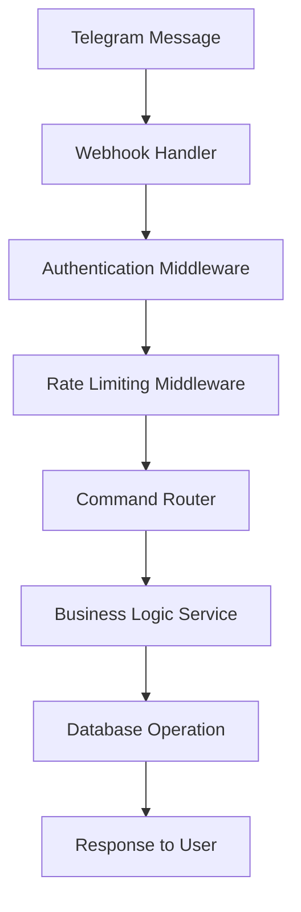

# 🏗️ Архитектура системы

Подробное описание архитектуры Telegram Ticket Bot системы.

## 📋 Общий обзор

Система построена по принципу микросервисной архитектуры с четким разделением ответственности между компонентами. Основные принципы:

- **Event-driven архитектура** для обработки событий Telegram
- **RESTful API** для взаимодействия с Mini App
- **WebSocket** для real-time коммуникации
- **Асинхронное программирование** для высокой производительности

## 🎯 Компоненты системы

```
┌─────────────────────────────────────────────────────────────────┐
│                          TELEGRAM                              │
├─────────────────────────────────────────────────────────────────┤
│  Bot Commands    │    Mini App     │    Notifications          │
│  /start, /help   │   Web Interface │   Push Messages           │
└─────────────────────────────────────────────────────────────────┘
                                │
                                ▼
┌─────────────────────────────────────────────────────────────────┐
│                      API GATEWAY                                │
├─────────────────────────────────────────────────────────────────┤
│ • FastAPI Router                                                │
│ • Authentication & Authorization                                │
│ • Rate Limiting & CORS                                          │
│ • Request/Response Validation                                   │
└─────────────────────────────────────────────────────────────────┘
                                │
                    ┌───────────┴───────────┐
                    ▼                       ▼
    ┌─────────────────────────┐    ┌─────────────────────────┐
    │    TELEGRAM BOT         │    │      WEB API            │
    │─────────────────────────│    │─────────────────────────│
    │ • aiogram 3.x           │    │ • FastAPI endpoints     │
    │ • Webhook handling      │    │ • JWT authentication    │
    │ • Command processing    │    │ • CRUD operations       │
    │ • Notification sending  │    │ • File uploads          │
    └─────────────────────────┘    └─────────────────────────┘
                    │                       │
                    └───────────┬───────────┘
                                ▼
┌─────────────────────────────────────────────────────────────────┐
│                    BUSINESS LOGIC                               │
├─────────────────────────────────────────────────────────────────┤
│ • Ticket Service     • User Service      • Notification Service│
│ • Message Service    • Category Service  • Statistics Service  │
│ • File Service       • Auth Service      • Webhook Service     │
└─────────────────────────────────────────────────────────────────┘
                                │
                    ┌───────────┴───────────┐
                    ▼                       ▼
    ┌─────────────────────────┐    ┌─────────────────────────┐
    │     WEBSOCKET           │    │    BACKGROUND JOBS      │
    │─────────────────────────│    │─────────────────────────│
    │ • Real-time chat        │    │ • Celery workers        │
    │ • Connection manager    │    │ • Email notifications   │
    │ • Event broadcasting    │    │ • File processing       │
    │ • Typing indicators     │    │ • Report generation     │
    └─────────────────────────┘    └─────────────────────────┘
                                │
                                ▼
┌─────────────────────────────────────────────────────────────────┐
│                       DATA LAYER                               │
├─────────────────────────────────────────────────────────────────┤
│  PostgreSQL     │     Redis        │    File Storage            │
│  • User data    │   • Sessions     │   • Uploaded files        │
│  • Tickets      │   • Cache        │   • Avatars               │
│  • Messages     │   • WebSocket    │   • Attachments           │
│  • Analytics    │   • Rate limits  │   • Temporary files       │
└─────────────────────────────────────────────────────────────────┘
```

## 🔧 Детальная архитектура

### 1. Telegram Integration Layer

#### 1.1. Bot Handler (`app/telegram/`)

**Ответственность:**
- Обработка входящих команд и сообщений
- Валидация пользователей
- Отправка уведомлений
- Управление Mini App сессиями

**Компоненты:**
```python
app/telegram/
├── bot.py                 # Основной бот и диспетчер
├── handlers/
│   ├── start.py          # Команда /start
│   ├── tickets.py        # Команды работы с тикетами
│   ├── admin.py          # Админские команды
│   └── callback.py       # Inline кнопки
├── middlewares/
│   ├── auth.py           # Аутентификация пользователей
│   ├── rate_limit.py     # Ограничение частоты запросов
│   └── logging.py        # Логирование активности
└── utils/
    ├── keyboards.py      # Клавиатуры и кнопки
    └── messages.py       # Шаблоны сообщений
```

**Поток обработки команд:**


#### 1.2. Mini App Integration

**Аутентификация через Telegram WebApp:**
```python
def validate_telegram_data(init_data: str, bot_token: str) -> bool:
    """
    Валидация подлинности данных от Telegram WebApp
    
    1. Парсинг initData
    2. Извлечение hash и данных
    3. Создание HMAC-SHA256 подписи
    4. Сравнение с переданным hash
    """
    data_check_string = create_data_check_string(init_data)
    secret_key = hmac.new("WebAppData".encode(), bot_token.encode(), hashlib.sha256).digest()
    computed_hash = hmac.new(secret_key, data_check_string.encode(), hashlib.sha256).hexdigest()
    return computed_hash == extracted_hash
```

### 2. API Layer (`app/api/`)

#### 2.1. REST API Endpoints

**Структура маршрутов:**
```python
app/api/
├── v1/
│   ├── auth.py           # JWT аутентификация
│   ├── tickets.py        # CRUD операции с тикетами  
│   ├── messages.py       # Сообщения в тикетах
│   ├── users.py          # Управление пользователями
│   ├── categories.py     # Категории тикетов
│   ├── files.py          # Загрузка и скачивание файлов
│   └── statistics.py     # Аналитика и отчеты
└── dependencies.py       # Зависимости для injection
```

**Dependency Injection Pattern:**
```python
async def get_current_user(token: str = Depends(oauth2_scheme)) -> User:
    """Получение текущего пользователя из JWT токена"""
    
async def require_role(min_role: UserRole) -> Callable:
    """Проверка минимального уровня роли для доступа"""
    
async def get_ticket_with_access(ticket_id: str, user: User) -> Ticket:
    """Получение тикета с проверкой прав доступа"""
```

#### 2.2. Request/Response Models (Pydantic)

**Схемы данных:**
```python
app/schemas/
├── ticket.py
│   ├── TicketCreate      # Создание тикета
│   ├── TicketUpdate      # Обновление тикета
│   ├── TicketResponse    # Ответ API
│   └── TicketListResponse
├── user.py
├── message.py
└── common.py             # Общие схемы (пагинация, ошибки)
```

### 3. Business Logic Layer (`app/services/`)

#### 3.1. Service Layer Pattern

```python
app/services/
├── ticket_service.py     # Бизнес-логика тикетов
├── user_service.py       # Управление пользователями  
├── message_service.py    # Обработка сообщений
├── notification_service.py # Система уведомлений
├── file_service.py       # Файловые операции
├── auth_service.py       # Аутентификация и авторизация
└── statistics_service.py # Аналитика и метрики
```

**Пример TicketService:**
```python
class TicketService:
    def __init__(self, db: AsyncSession, notification_service: NotificationService):
        self.db = db
        self.notification_service = notification_service
    
    async def create_ticket(self, ticket_data: TicketCreate, user: User) -> Ticket:
        """
        1. Валидация данных
        2. Создание тикета в БД
        3. Назначение на available помощника (если есть)
        4. Отправка уведомлений
        5. Логирование события
        """
        
    async def assign_ticket(self, ticket_id: str, assignee_id: str, assigner: User) -> Ticket:
        """
        1. Проверка прав на назначение
        2. Проверка роли назначаемого
        3. Обновление статуса
        4. Уведомление участников
        """
```

#### 3.2. Event System

**Event-driven обновления:**
```python
from enum import Enum
from typing import Any, Dict

class EventType(Enum):
    TICKET_CREATED = "ticket_created"
    TICKET_ASSIGNED = "ticket_assigned"
    TICKET_STATUS_CHANGED = "ticket_status_changed"
    MESSAGE_SENT = "message_sent"

class EventBus:
    def __init__(self):
        self.handlers = {}
    
    def subscribe(self, event_type: EventType, handler: Callable):
        """Подписка на события"""
        
    async def publish(self, event_type: EventType, data: Dict[str, Any]):
        """Публикация события всем подписчикам"""
```

### 4. WebSocket Layer (`app/websocket/`)

#### 4.1. Connection Management

```python
app/websocket/
├── connection_manager.py  # Управление подключениями
├── ticket_chat.py         # Chat в тикетах
└── events.py             # WebSocket события
```

**ConnectionManager:**
```python
class ConnectionManager:
    def __init__(self):
        self.active_connections: Dict[str, List[WebSocket]] = {}
        self.user_connections: Dict[str, WebSocket] = {}
    
    async def connect(self, websocket: WebSocket, ticket_id: str, user_id: str):
        """Подключение пользователя к чату тикета"""
        
    async def disconnect(self, websocket: WebSocket, ticket_id: str):
        """Отключение и очистка"""
        
    async def send_to_ticket(self, ticket_id: str, message: dict):
        """Отправка сообщения всем участникам тикета"""
        
    async def send_to_user(self, user_id: str, message: dict):
        """Персональное сообщение пользователю"""
```

#### 4.2. Real-time Events

**Типы WebSocket событий:**
```python
class WSEventType(Enum):
    # Сообщения
    MESSAGE_NEW = "message_new"
    MESSAGE_TYPING = "message_typing"
    MESSAGE_READ = "message_read"
    
    # Тикеты
    TICKET_STATUS_CHANGED = "ticket_status_changed"
    TICKET_ASSIGNED = "ticket_assigned"
    
    # Пользователи
    USER_ONLINE = "user_online"
    USER_OFFLINE = "user_offline"
    
    # Системные
    NOTIFICATION = "notification"
    ERROR = "error"
```

### 5. Data Access Layer (`app/models/`)

#### 5.1. SQLAlchemy Models

```python
app/models/
├── __init__.py          # Импорты и настройки
├── base.py              # Базовая модель
├── user.py              # Модель пользователя
├── ticket.py            # Модель тикета
├── message.py           # Модель сообщения
├── category.py          # Модель категории
├── notification.py      # Модель уведомления
└── file.py             # Модель файла
```

**Базовая модель с общими полями:**
```python
class BaseModel:
    id = Column(UUID, primary_key=True, default=uuid4)
    created_at = Column(DateTime(timezone=True), server_default=func.now())
    updated_at = Column(DateTime(timezone=True), onupdate=func.now())
    
    # Методы для serialization
    def to_dict(self) -> Dict[str, Any]:
        return {c.name: getattr(self, c.name) for c in self.__table__.columns}
```

#### 5.2. Repository Pattern

```python
app/repositories/
├── base.py              # Базовый репозиторий
├── ticket.py            # Репозиторий тикетов
├── user.py              # Репозиторий пользователей
└── message.py           # Репозиторий сообщений

class BaseRepository:
    def __init__(self, db: AsyncSession, model: DeclarativeMeta):
        self.db = db
        self.model = model
    
    async def get(self, id: str) -> Optional[T]:
        """Получение по ID"""
        
    async def get_multi(self, skip: int = 0, limit: int = 100) -> List[T]:
        """Получение списка с пагинацией"""
        
    async def create(self, obj_in: BaseModel) -> T:
        """Создание записи"""
        
    async def update(self, db_obj: T, obj_in: BaseModel) -> T:
        """Обновление записи"""
        
    async def delete(self, id: str) -> bool:
        """Удаление записи"""
```

### 6. Background Jobs (`app/celery/`)

#### 6.1. Celery Tasks

```python
app/celery/
├── __init__.py          # Celery app
├── tasks/
│   ├── notifications.py # Отправка уведомлений
│   ├── reports.py       # Генерация отчетов
│   ├── cleanup.py       # Очистка временных файлов
│   └── analytics.py     # Обновление статистики
└── schedules.py         # Периодические задачи
```

**Примеры задач:**
```python
@celery_app.task
async def send_email_notification(user_id: str, notification_data: dict):
    """Отправка email уведомления"""
    
@celery_app.task  
async def generate_monthly_report(admin_id: str):
    """Генерация месячного отчета"""
    
@celery_app.task
async def cleanup_old_files():
    """Очистка старых временных файлов"""
```

## 🔐 Безопасность

### 7.1. Аутентификация и авторизация

**Многоуровневая система безопасности:**

1. **Telegram WebApp валидация** - проверка подлинности данных от Telegram
2. **JWT токены** - для API аутентификации
3. **Role-based access control** - проверка ролей для доступа к ресурсам
4. **Rate limiting** - ограничение частоты запросов
5. **Input validation** - валидация всех входных данных

### 7.2. Защита от атак

**Реализованные меры защиты:**
- **SQL Injection** - параметризованные запросы через SQLAlchemy
- **XSS** - валидация и санитизация HTML контента
- **CSRF** - CSRF токены для изменяющих операций
- **File Upload** - проверка типов файлов и размеров
- **DoS** - rate limiting и connection limiting

## 📊 Мониторинг и логирование

### 8.1. Структурированное логирование

```python
import structlog

logger = structlog.get_logger()

# Контекстное логирование
logger.info("Ticket created", 
           ticket_id=ticket.id,
           user_id=user.id, 
           category=ticket.category.name)

# Логирование ошибок с трейсом
logger.error("Database connection failed",
            error=str(e),
            traceback=traceback.format_exc())
```

### 8.2. Метрики и аналитика

**Собираемые метрики:**
- Время ответа API endpoints
- Количество активных WebSocket соединений
- Статистика обработки тикетов
- Ошибки и исключения
- Использование ресурсов (CPU, RAM, DB connections)

## 🚀 Масштабирование

### 9.1. Горизонтальное масштабирование

**Стратегии масштабирования:**

1. **Load Balancer** - распределение нагрузки между экземплярами API
2. **Database Read Replicas** - чтение из реплик для лучшей производительности
3. **Redis Cluster** - кластеризация Redis для масштабирования кэша
4. **Microservices** - разделение на независимые сервисы
5. **CDN** - доставка статических файлов через CDN

### 9.2. Оптимизация производительности

**Техники оптимизации:**
- **Connection Pooling** - пул соединений к БД
- **Query Optimization** - оптимизация запросов и индексы
- **Caching Strategy** - многоуровневое кэширование
- **Async Processing** - асинхронная обработка долгих операций
- **File Compression** - сжатие загружаемых файлов

## 🔄 CI/CD Pipeline

### 10.1. Развертывание

```yaml
# .github/workflows/deploy.yml
name: Deploy
on:
  push:
    branches: [main]

jobs:
  test:
    runs-on: ubuntu-latest
    steps:
      - uses: actions/checkout@v3
      - name: Run tests
        run: pytest app/tests/
      
  deploy:
    needs: test
    runs-on: ubuntu-latest
    steps:
      - name: Deploy to production
        run: |
          docker build -t telegram-tickets .
          docker-compose up -d
```

### 10.2. Мониторинг в продакшене

**Инструменты мониторинга:**
- **Health Checks** - проверка состояния сервисов
- **Prometheus/Grafana** - метрики и дашборды
- **Sentry** - отслеживание ошибок
- **ELK Stack** - централизованное логирование

## 📋 Архитектурные решения и паттерны

### 11.1. Применяемые паттерны

1. **Repository Pattern** - абстракция доступа к данным
2. **Service Layer Pattern** - бизнес-логика в отдельном слое
3. **Dependency Injection** - инверсия зависимостей
4. **Event Sourcing** - сохранение событий изменения состояния
5. **CQRS** - разделение команд и запросов
6. **Observer Pattern** - уведомления об изменениях

### 11.2. Принципы проектирования

- **Single Responsibility Principle** - каждый класс имеет одну ответственность
- **Open/Closed Principle** - открыт для расширения, закрыт для модификации  
- **Dependency Inversion** - зависимость от абстракций, не от конкретных реализаций
- **Domain-Driven Design** - моделирование предметной области
- **Clean Architecture** - четкое разделение слоев

Эта архитектура обеспечивает высокую производительность, масштабируемость и поддерживаемость системы, позволяя легко добавлять новые функции и адаптироваться под изменяющиеся требования.